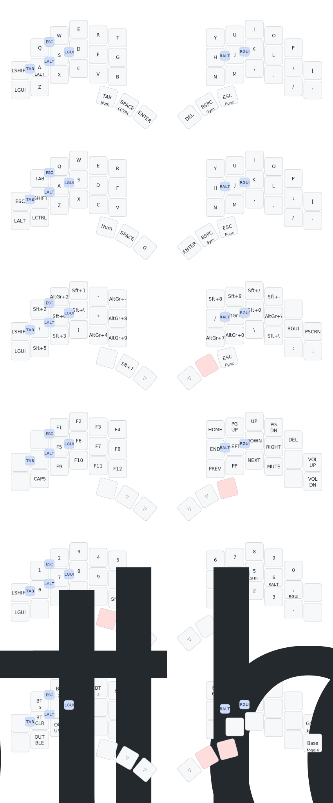

# ZMK Config

Personal [ZMK](https://zmk.dev/) firmware configuration for split ergonomic keyboards with full Swedish locale support.

## Supported Keyboards

| Keyboard | Keys | Controller | Display | Shield Source |
| -------- | ---- | ---------- | ------- | ------------- |
| [Brain](https://github.com/Wesztman/brain) | 40 | nice!nano | nice!view | Custom (in-repo) |
| [Urchin](https://github.com/duckyb/urchin) | 34 | nice!nano | nice!view | Custom (in-repo) |
| Cradio / Sweep | 34 | — | — | Upstream ZMK |

All three are split keyboards using a Pro Micro-compatible footprint. Brain and Urchin include custom shield definitions under `config/boards/shields/`. Urchin and Cradio share the same 34-key keymap.

## Features

- **Swedish key support** — Custom macros in `config/swe_keys.h` for Å, Ä, Ö and all Swedish-layout symbols (shifted and AltGr variants)
- **Homerow mods** — Two hold-tap flavors (`hm` at 200 ms, `hs` at 300 ms), both tap-preferred, with quick-tap for key repeat
- **Combos** — Esc, Tab, and modifier combos on both keymaps; Å, Ä, Ö accessible via combos on the 34-key base layers
- **Tri-layer** — Holding SYMBOLS\_SWE + FUNC activates the SETTINGS layer
- **Gaming layer** — Dedicated layer with game-friendly bindings and Swedish characters on both keymaps
- **Multiple base layers** — The 34-key keymap includes switchable Default (Colemak-ish), QWERTY, and Gaming base layers

## Layers

### Brain (40-key)

| Layer | Description |
| ----- | ----------- |
| DEFAULT | Alpha layout with Ö, Å, Ä and dedicated shift/GUI keys |
| GAMING | Number row on left hand, quick access to symbol/function layers |
| SYMBOLS\_SWE | Swedish symbol macros — brackets, quotes, pipes, etc. |
| FUNC | F1–F12, navigation, media controls, Caps Lock |
| NUMBER | Full digit row, arithmetic operators |
| SETTINGS | Bluetooth profiles, BLE/USB output, bootloader, layer toggles |

### Cradio / Urchin (34-key)

| Layer | Description |
| ----- | ----------- |
| DEFAULT | Colemak-style alpha with full homerow mods (GUI, Alt, Shift, Ctrl) |
| QWERTY | Traditional QWERTY alternative |
| GAMING | Game-optimized left hand with Tab, Shift, Ctrl |
| SYMBOLS\_SWE | Swedish symbol macros + Å, Ä, Ö |
| FUNC | F1–F12, navigation, media controls, Caps Lock |
| NUMBER | Digits with homerow-style modifiers |
| SETTINGS | Bluetooth, output switching, bootloader, base layer toggles |

## Brain Layout



## Building

Firmware is built via GitHub Actions. The active build targets in `build.yaml` are:

```
brain_left  + nice_view_adapter nice_view  (nice_nano)
brain_right + nice_view_adapter nice_view  (nice_nano)
settings_reset                             (nice_nano)
```

Urchin and Cradio targets exist in `build.yaml` but are commented out. Uncomment them to build those variants.

The repo tracks ZMK `main` via `config/west.yml`.

## Symbol Mnemonics

Reference for which key produces which symbol on the symbol layers:

| Symbol | Name                         |  Letter   | Mnemonic           |
| :----: | ---------------------------- | :-------: | ------------------ |
|  `!`   | Exclamation mark             |    `F`    | **F**UCK!!         |
|  `#`   | Hash                         |    `X`    | **X**≈#            |
|  `$`   | Dollar                       |    `D`    | **D**ollar         |
|  `%`   | Percent                      |    `Z`    | **Z**≈%            |
|  `^`   | Caret                        |    `C`    | **C**aret          |
|  `&`   | And                          |    `R`    | **R**≈&            |
|  `*`   | Asterisk, star               |    `S`    | **S**tar           |
|  `_`   | Underscore                   |    `U`    | **U**nderscore     |
|  `-`   | Hyphen, minus, or dash       |    `M`    | **M**inus          |
|  `+`   | Plus                         |    `P`    | **P**lus           |
|  `=`   | Equal                        |    `E`    | **E**qual          |
|  `\`   | Backslash                    |    `B`    | **B**ackslash      |
|  `\|`  | Vertical bar, pipe, or or    |    `I`    | **I**≈\|           |
|  `'`   | Apostrophe, Single quote     |    `A`    | **A**postrophe     |
|  `"`   | Quotation mark, Double quote |    `Q`    | **Q**uotation mark |
|  `?`   | Question mark                |    `?`    | Wh**y**?, **y**?   |
|  `~`   | Tilde                        |    `N`    | None               |
|  `@`   | At                           |    `W`    | None               |
|  `(`   | Open or Left parenthesis     |    `J`    | None               |
|  `)`   | Close or Right parenthesis   |    `L`    | None               |
|  `{`   | Open or Left brace           |    `K`    | None               |
|  `}`   | Close or Right brace         |    `H`    | None               |
|  `[`   | Open or Left bracket         |    `G`    | None               |
|  `]`   | Close or Right bracket       |    `V`    | None               |
|  `<`   | Less than                    |    `,`    | None               |
|  `>`   | Greater than                 |    `:`    | None               |
|  `;`   | Semicolon                    | baselayer | None               |
|  `:`   | Colon                        | baselayer | None               |
|  `,`   | Comma                        | baselayer | None               |
|  `.`   | Period, dot, or full stop    | baselayer | None               |
|  `/`   | Slash or forward slash       | baselayer | None               |

## TODO

- [x] Mnemonics in markdown instead of the picture
- [ ] Finish layout for brain
- [ ] Caps word [more info](https://getreuer.info/posts/keyboards/caps-word/index.html)
- [ ] Caps number [more info](https://github.com/zmkfirmware/zmk/pull/1451)
